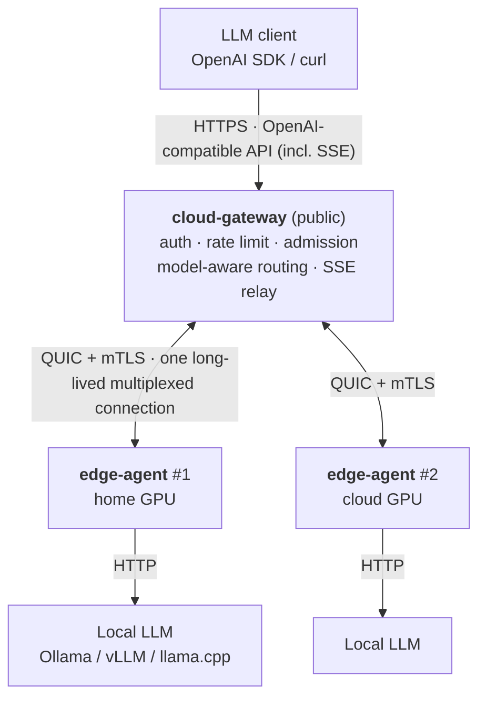

<p align="center"><a href="README.md">中文</a> | <b>English</b></p>

# home-llm-gateway

**An edge LLM gateway in Rust: it exposes local models running behind NAT on your home or office network as an OpenAI-compatible API on the public Internet.**

It solves one specific networking problem: the model runs on a machine behind NAT (dynamic IP, no inbound
port), and you want to call it from anywhere with a standard OpenAI SDK — **without ever exposing the
local inference endpoint to the public Internet.**

```
Client (anywhere)
   │  HTTPS · OpenAI-compatible API (incl. SSE streaming)
   ▼
cloud-gateway (public server)   API-key auth → rate limit → admission → route by model → tunnel frames
   │  QUIC (UDP, mutual TLS, one connection multiplexed, no head-of-line blocking)
   ▼
edge-agent (model host)         dials out + heartbeat + auto-reconnect → proxies to the local LLM
   │  HTTP
   ▼
Local LLM (Ollama / vLLM / llama.cpp)
```

**No external tunnel or proxy service required** — no frp, ngrok, nginx or caddy. The tunnel, authentication,
streaming relay and TLS all live in these three Rust crates.

> **Note on documentation**: this README is bilingual, but the deep-dive documents
> (`DESIGN.md`, `OPTIMIZATION.md`, `DEPLOY.md`, …) are written in Chinese. This file covers the same
> ground as the [Chinese README](README.md) and points at the same documents.

---

## Architecture



### Client → Gateway

The single public entry point is `cloud-gateway`. It exposes **OpenAI-compatible** `/v1/*` paths
(`/v1/chat/completions`, `/v1/embeddings`, … are forwarded verbatim to an edge; `/v1/models` is answered
by the gateway itself, aggregated across edges), supports **SSE streaming**, and performs API-key
authentication and rate limiting before forwarding. HTTPS is served directly with `rustls` —
**no reverse proxy required** (the tunnel speaks a private frame protocol, so a reverse proxy could not
handle it anyway).

### Gateway → Agent

The tunnel uses **QUIC** rather than TCP+TLS for three practical reasons: QUIC streams are
**independent** (one slow stream does not block others on the same connection, which TCP would);
**connection migration** lets the edge agent potentially survive a network address change without reconnecting (a QUIC transport property, not separately validated by this project); and the handshake is
1-RTT.

**The agent dials out** — that is the key to the whole design. The local machine needs no inbound port,
no public IP and no DDNS, so NAT and dynamic IPs stop being a problem. **mTLS** authenticates both
directions: the agent presents a client certificate signed by your own CA, and unregistered peers are
rejected during the handshake.

### Agent → LLM

The agent does exactly one thing: turn a request frame arriving on the tunnel into an HTTP request to
the local LLM, and stream the response back. Point `upstream` at your local service
(Ollama on `:11434`, vLLM / llama.cpp on `:8000`) — nothing on the upstream side needs changing.

> Protocol details (frame format, state machine, cancellation semantics) are in [`DESIGN.md`](DESIGN.md).

---

## Why

- **A local inference endpoint should not be exposed to the public Internet.** All three local servers
  (Ollama / vLLM / llama.cpp) are **unauthenticated** by default. Publish the port and you hand over the
  GPU and the prompts together.
- **Home and office networks have no stable inbound entry.** Dynamic IPs, CGNAT, ISPs blocking inbound
  ports — port forwarding simply is not available in most home-broadband setups. An outbound reverse
  connection sidesteps that entire class of problems.
- **Clients want the OpenAI API, not a bespoke protocol.** Standard SDKs, standard paths, standard SSE:
  integration cost is "change one `base_url`".
- **One machine is not enough, and the models differ.** One box at home serves `qwen2.5`, one cloud GPU
  serves `llama3`; the client sends a `model` and the gateway decides where it goes.

---

## Core Features

**API**
- OpenAI-compatible: `/v1/*` forwarded verbatim; `/v1/models` aggregated by the gateway across healthy edges
- SSE streamed chunk by chunk (typewriter effect); the whole response is never buffered in the gateway
- Client disconnect / stall → `Cancel` is sent upstream so the edge stops burning tokens
- 16 MiB request-body limit; request-path guard (rejects dot segments and `%2e`·`%2f`-style encoded separators)

**Edge Connectivity**
- QUIC tunnel + mTLS, agent dials out, NAT traversal for free
- Heartbeat with staleness detection; exponential backoff reconnect (jittered)
- Configurable per-connection stream ceiling, so "queueing" is not misread as "broken tunnel"

**Routing**
- Candidates filtered by the request's `model`: an exact declaration wins over a `models: ["*"]` wildcard
- Least-in-flight within the group; agents with stale heartbeats stop being candidates
- No agent available → 503; nobody serves that model → 404; capacity full → 429 (the three causes are
  counted separately in metrics)

**Security**
- API keys: `sha256(token)` fast index lookup + **argon2id** verification, **plaintext never stored**
- Verified-identity cache (single-flight + credential-version check) turns argon2 from "once per request"
  into "once per credential version" — and **revocation is still immediate**, not TTL-based
- Caller credentials (`Authorization` / `Cookie`) stay on the *client ↔ gateway* hop and are **not**
  forwarded to the edge (if your upstream needs auth, configure it on the agent)
- `admin_token` is independent from API keys; `/admin/*` responses carry `Cache-Control: no-store`

**Reliability**
- Establishment-phase failures (open stream / write request frame) are **retried on another agent**:
  the request frame provably never arrived, so replay has no side effects
- Response-head timeout (504) is **deliberately not retried**: the request may already be executing on
  the model, and a replay would double-bill and double-generate
- "Busy" and "dead" are handled separately, so a local overload is never mistaken for a broken
  connection and evicted (see Core Design)
- All five client-side waits on the entry path are bounded, so a stalled client cannot pin an admission
  slot forever

**Observability**
- `/metrics` in Prometheus text format; `/healthz` liveness probe (JSON body with agent diagnostics)
- Structured request logs carrying `request_id`, status and latency
- Built-in React admin dashboard: overview / API keys / agents / metrics

---

## Quick Start

Everything runs locally, **no real model required** (`mock-llm` stands in for the upstream).

**Prerequisites**: Rust 1.97+ (toolchain version in `rust-toolchain.toml`), the `openssl` CLI, and
`pnpm` (only for the dashboard).

```bash
git clone <repo> && cd home-llm-gateway

make setup     # generate dev certificates (certs/out/) + install frontend deps
make dev       # build debug binaries, then bring up mock-llm + gateway + agent
               # if any process fails to start it exits with an error and prints that process's log tail
```

Once `make dev` is up (logs in `.tmp/logs/`):

```bash
# 1) Create your first API key — the gateway has no static keys, everything is issued at runtime
KEY=$(curl -s -X POST http://127.0.0.1:8080/admin/keys \
  -H "Authorization: Bearer dev-admin" -H "Content-Type: application/json" \
  -d '{"name":"dev"}' | python3 -c "import sys,json;print(json.load(sys.stdin)['key'])")

# 2) Send a request — exercises HTTP → auth → QUIC tunnel → agent → upstream
curl -H "Authorization: Bearer $KEY" -H "Content-Type: application/json" \
  http://127.0.0.1:8080/v1/chat/completions \
  -d '{"model":"mock-llm","messages":[{"role":"user","content":"hello"}]}'

# 3) Streaming
curl -N -H "Authorization: Bearer $KEY" -H "Content-Type: application/json" \
  http://127.0.0.1:8080/v1/chat/completions \
  -d '{"model":"mock-llm","stream":true,"messages":[{"role":"user","content":"hello"}]}'
```

An echo from the mock means the whole chain works. `make stop` shuts everything down; `make help` lists
all targets.

**Connecting a real model**: point `upstream` in `agent-config.yml` at your local service.

| Local service | `upstream` |
|---|---|
| Ollama | `http://127.0.0.1:11434` |
| vLLM | `http://127.0.0.1:8000` |
| llama.cpp server | `http://127.0.0.1:8000` |

---

## API Example

```bash
curl https://<your-gateway>:8443/v1/chat/completions \
  -H "Authorization: Bearer sk-..." \
  -H "Content-Type: application/json" \
  -d '{"model":"qwen2.5","stream":true,
       "messages":[{"role":"user","content":"Explain QUIC in one sentence"}]}'
```

Any OpenAI-compatible client works the same way — change `base_url` and `api_key`:

```python
from openai import OpenAI
client = OpenAI(base_url="https://<your-gateway>:8443/v1", api_key="sk-...")
client.chat.completions.create(model="qwen2.5", messages=[{"role": "user", "content": "hello"}])
```

**Admin API** (enabled by `admin_token`; there is also a web UI at `/`):

```bash
curl -X POST   http://127.0.0.1:8080/admin/keys      -H "Authorization: Bearer <admin-token>" \
  -H "Content-Type: application/json" -d '{"name":"dsh-client"}'   # returns the plaintext key, once
curl           http://127.0.0.1:8080/admin/keys      -H "Authorization: Bearer <admin-token>"   # list (masked)
curl -X DELETE http://127.0.0.1:8080/admin/keys/<id> -H "Authorization: Bearer <admin-token>"   # revoke (immediate)
curl           http://127.0.0.1:8080/admin/agents    -H "Authorization: Bearer <admin-token>"
curl           http://127.0.0.1:8080/admin/usage     -H "Authorization: Bearer <admin-token>"
```

---

## Core Design

The README states **conclusions only**; the rationale, measurements and trade-offs are in the documents
named in each section.

### 1. Outbound dialing + a QUIC tunnel, instead of port forwarding

The agent opens **one long-lived connection** to the cloud, and requests are multiplexed over it as
**one QUIC bidirectional stream per request**. You get: zero inbound ports locally, NAT traversal for
free, and dozens of in-flight requests on one machine that do not block each other (they would on TCP).
The price is a custom binary protocol with 8 frame types (`Register` / `Heartbeat` / `ProxyRequest` /
`ProxyResponseHead` / `ProxyResponseBody` / `ProxyResponseEnd` / `Cancel` / `Error`).
→ `DESIGN.md` §3–§4

### 2. SSE streaming & cancellation propagation

Responses are **forwarded chunk by chunk; the gateway never buffers the whole body**. Each upstream SSE
chunk becomes one `ProxyResponseBody` frame and is written to the client immediately, so a long answer
is a typewriter, not a buffer-and-flush.

**Cancellation travels only as a `Cancel` frame**: when the client disconnects or stalls, the gateway sends
`Cancel` explicitly, and the agent uses it to abort the in-flight upstream request — an abandoned request
does not keep burning GPU/tokens. The response phase has three distinct timeouts (per-frame idle / client
stall / cancel-frame write), and all three are load-bearing.

**Every relay ending carries an explicit "this is incomplete" signal**: once the response body starts
streaming, the HTTP status has already gone out (200), and everything that fails afterwards (upstream
disconnect, idle timeout, client stall, a panicking forwarding task) is invisible in the access log. So
every ending funnels into an explicit outcome enum (9 normal exits plus `panicked`), counted per class;
the panic class also **aborts the response body**, so a client cannot mistake a truncated answer for a
complete one. On shutdown, the terminating event for in-flight SSE is `event: error`, and **never
`data: [DONE]`** — the latter is OpenAI's "finished normally" marker.
→ `DESIGN.md` §4.3, §12

### 3. Retry only when the frame never arrived

`write_frame` is a single `write_all`: it returns only when every byte was accepted, so a timeout means
an incomplete frame, and the agent's `FrameReader` will not touch the upstream before it has read the
full length prefix and payload. Therefore **open-stream and write-request-frame failures can safely be
replayed on another connection**.

A **response-head timeout cannot be retried**: the request may already be executing on the model, and a
replay would double-bill and double-generate (with `temperature > 0` the results would even differ).
Making that safely retryable needs protocol-level deduplication (a globally unique `request_uid` plus a
dedup table on the agent) — the full design is in [`EXACTLY_ONCE.md`](EXACTLY_ONCE.md), and it is
**currently a proposal, not implemented**.
→ `DESIGN.md` §5, `EXACTLY_ONCE.md`

### 4. "Busy" and "dead" must be distinguished — a judgment paid for by a real incident

A timeout does not mean the connection is dead. An open-stream timeout may simply mean **in-flight
requests have hit the capacity ceiling and are queueing for QUIC stream credit** (normal backpressure);
a response-head timeout may simply mean **the upstream is slow to first byte** (the model is thinking).

Treating either as "dead" **amplifies a local overload into a full outage**: evict → connection closed →
agent reconnects (backoff up to 30s) → no routable agent in the meantime → everything 503. Measured once
in the cloud: during a 30-second load test, `registry-empty` +6835 and 503 +6057. The current criteria
are "**has in-flight reached the capacity ceiling**" (open stream) and "**was there a successful response
head within the window / is the peer still talking**" (response head), with `busy`/`dead` and
`slow`/`silent` exposed as separate classes — so "scale up" and "check the network" are distinguishable
at a glance.
→ `DESIGN.md` §5

### 5. Model-aware routing: candidate selection & load balancing

The client sends a `model`; the gateway decides which edge it goes to. Four steps, each with a distinct
failure meaning:

| Step | Rule | On failure |
|---|---|---|
| Health | keep only edges with a fresh heartbeat | none fresh / none at all → 503 |
| Model | keep only edges declaring this `model` (or `*`) | nobody serves it → 404 |
| Order | an **exact declaration wins** over a `*` wildcard; least-in-flight within the group | — |
| Admission | an atomic slot acquisition is required; full → try the next | all full → 429 |

`*` is a **fallback, not a competitor** — which is why `/v1/models` does not list `*` edges (listing them
would mislead the client: they accept any request, but only the upstream knows what they can actually run).
→ `MODEL_ROUTING.md`, `DESIGN.md` §5

### 6. Three separate gates: rate, per-agent concurrency, global in-flight

They do different jobs and cannot substitute for one another; conflating them yields wrong capacity
conclusions:

| Config | What it bounds | What it protects |
|---|---|---|
| `rate_limit_per_min` | **request rate** per API key (token bucket) | fairness / cost |
| agent `max_concurrency` | in-flight requests **per edge** | the edge's GPU |
| `max_concurrent_requests` | total in-flight requests **in the gateway** | the gateway itself |
| `max_entry_connections` | concurrent public **connections** (pauses accept when full, does not reject) | file descriptors |

`/healthz` and `/metrics` each get their own **separate, generous** budget so they never consume the
gated one — otherwise a 429 on the probe would make a load balancer evict a **healthy** instance,
turning "slow" into "all down".
→ `REBUILD.md` §4.1, `DESIGN.md` §5

### 7. argon2 is memory-hard, so it cannot run once per request

Each `argon2id` verification holds **19 MiB** of working memory (`m=19456 KiB`), and that adds up
linearly with concurrency — "verify once per request" means gateway memory equals
`in-flight requests × 19 MiB`. Controlled A/B measurement at 64 concurrency: **1 236.5 MB vs 27.1 MB**
(cache off vs on).

It now goes through a **verified-identity cache with single-flight**: `sha256(token)` locates the record
in O(1), and a hit skips argon2 entirely (just two comparisons, `enabled` and `cred_version`); concurrent
cold starts for the same token are serialized so argon2 runs once. **Revocation is still immediate** —
it relies on the credential version, not a TTL.
→ `DESIGN.md` §5 ("verified-identity cache"), `OPTIMIZATION.md` §8

---

## Testing

```bash
make test                              # cargo test (serialization via #[serial])
cargo nextest run --workspace          # what CI uses
make check                             # the full gate: see below
```

Coverage: protocol frame round-trips, streaming and cancellation, auth and rate limiting, model routing,
admission and concurrency, graceful shutdown, real-process startup/signal/log behaviour, and end-to-end
full-chain tests (certificates generated in memory, a complete QUIC + mTLS stack, no external services).

`make check` is the one-command local equivalent of CI:

```
fmt · clippy -D warnings · cargo deny · nextest · web-format · web-lint · web-test ·
web-build · toolchain-check · check-records
```

> **Current scale (`cargo nextest run --workspace`, measured)**: **368 tests executed and passed (0 skipped)**, of which
> **69 are e2e** (each spinning up a complete QUIC + mTLS stack in its own process). The number changes
> per commit; trust the actual run output.
>
> Two behaviours differ from `cargo test` and are worth knowing: **nextest runs one process per test**,
> so `serial_test`'s `#[serial]` (an in-process lock) stops working under it — e2e serialization is
> instead guaranteed by a `test-group` in `.config/nextest.toml`; and **nextest does not run doctests**.

---

## Performance

The repository carries two kinds of performance evidence, and **the full data with its measurement
preconditions does not live here**:

- **Criterion micro-benchmarks** (function level): `cargo bench` (frame codec, keystore hot path)
- **System-level load tests**: k6 scripts under `scripts/bench-k6/` (SSE long streams + non-streaming
  throughput, with built-in success-rate and latency-percentile assertions); `oha` works for a quick check

```bash
cargo bench                   # or: make bench
make dev && make bench-k6 KEY=<sk-...> VUS=20 DUR=30s
```

**The README keeps only two conclusions, because they change how you deploy**:

1. **Gateway memory tracks "in-flight", not "request count"** — provided the verified-identity cache is on
   (`verified_cache_max`, the default). Setting it to `0` makes every in-flight request cost ~19 MiB, in
   which case `max_concurrent_requests` must stay under `MemoryMax / 20MB`, or the thing you hit first is
   an OOM kill rather than a graceful 429.
2. **When load testing, identify whose bottleneck it is first**: the order is **agent event rate → link
   bandwidth → gateway**. At the 20–100 token/s of a real model none of these are close; the numbers below
   only matter when you "make the model fast" or "use the gateway to relay small non-LLM requests".

→ **Full measurements** (memory A/B table, per-event agent CPU, throughput ceilings, cloud egress
bandwidth, request-size ladder, loopback, 768-concurrency run) are in
**[`OPTIMIZATION.md`](OPTIMIZATION.md) §8**

---

## Deployment

Production deployment (certificate issuance, security groups, systemd / Docker, verification,
troubleshooting) is in **[`DEPLOY.md`](DEPLOY.md)**. The essentials:

1. **Gateway on a public server**: allow **UDP 4433** (QUIC tunnel) and **TCP 8443** (HTTPS API) in your
   security group. UDP is easy to forget — QUIC runs over UDP. **The current version is UDP-only and
   does not implement a TCP fallback**; if UDP is blocked, allow UDP 4433 for now. A TCP+TLS downgrade
   is a contingency design only — see [`DESIGN.md`](DESIGN.md) §10.
2. **Agent on the model host**: set `cloud_addr` to `<public-ip>:4433` and `server_name` to a name in the
   certificate's SAN.
3. **mTLS is the critical security line**: keep the CA private key to yourself and issue a **separate
   client certificate per agent**.
4. Deployment forms: a single static binary (Linux musl / macOS) with systemd units, or Docker Compose
   (`crates/gateway/Dockerfile` already bakes the dashboard into the image, so you do not build the
   frontend yourself).
5. **Multiple edges (heterogeneous models)**: give each machine its own `agent-config.yml` declaring its
   `models`. A config example and the `agent_id`-must-be-unique trap are in
   [`MODEL_ROUTING.md`](MODEL_ROUTING.md) §7.

> On startup the gateway raises its own `RLIMIT_NOFILE` soft limit to `min(hard, 16384)` — systemd's
> default of 1024 is uncomfortably close at production levels (768 concurrent connections → fd peak 785).
> The rationale and the split of responsibilities with the unit file are in `DESIGN.md` §14.

---

## Repository Structure

```
crates/
├── proto/      tunnel frame protocol + shared primitives (frame codec, mTLS material loading,
│               hop-by-hop / credential header filtering, path guard)
├── gateway/    cloud-gateway binary (Axum + Tokio + s2n-quic server + SQLite keystore)
├── agent/      edge-agent binary (Tokio + s2n-quic client + reqwest)
└── mock-llm/   fake OpenAI-compatible LLM (to bring up the chain without a real model)
web/            React + TS admin dashboard (Vite + React 19 + Tailwind; served by the gateway)
certs/          dev certificate generation script
deploy/         systemd units (gateway.service / agent.service)
scripts/        release packaging · k6 load tests · toolchain consistency check · git pre-commit hook
gateway_config.example.yml / agent_config.example.yml   both config templates (all parameters documented)
deny.toml       cargo-deny policy (dependency licenses / advisories)
```

> Config file names are fixed: `gateway-config.yml` for the gateway and `agent-config.yml` for the agent
> (identical locally and in production; both contain secrets and are gitignored).

---

## Documentation

| Document | Contents |
|---|---|
| [`DESIGN.md`](DESIGN.md) | **Architecture & protocol**: why QUIC, frame protocol, timeout matrix, retry and eviction semantics, security checklist, observability spec, NOFILE |
| [`MODEL_ROUTING.md`](MODEL_ROUTING.md) | **Model routing**: filtering candidates by model, exact-over-wildcard, `/v1/models` aggregation |
| [`OPTIMIZATION.md`](OPTIMIZATION.md) | **Optimization plan + measurement record**: what was changed, and the full memory / CPU / throughput data with preconditions |
| [`DEPLOY.md`](DEPLOY.md) | **Deployment**: certificate issuance, security groups, systemd / Docker, upgrades, troubleshooting |
| [`REBUILD.md`](REBUILD.md) | **Rebuild blueprint**: irreversible decisions, traffic and concurrency specs, 12 acceptance assertions |
| [`EXACTLY_ONCE.md`](EXACTLY_ONCE.md) | **Proposal (not implemented)**: protocol-level dedup so response-head timeouts can be retried safely |
| [`CODE_READING.md`](CODE_READING.md) | **Code reading guide**: where to start, anchor files, verification-driven learning |
| [`TODO.md`](TODO.md) | **Development status and roadmap** (also the register of known issues) |

*(The documents above are written in Chinese; this README is the English entry point.)*

---

## Roadmap

See **[`TODO.md`](TODO.md)** — current development status, known issues and priorities.

Two items are directly relevant to users and their status should be stated plainly:

- **`EXACTLY_ONCE.md` is a proposal, not implemented.** As of today a response-head timeout (504) is
  **not** retried automatically.
- **Multiple CA trust roots** and **finer-grained usage metering** are likewise registered in `TODO.md`
  and not yet implemented.

---

## License

MIT, see [`LICENSE`](LICENSE).
