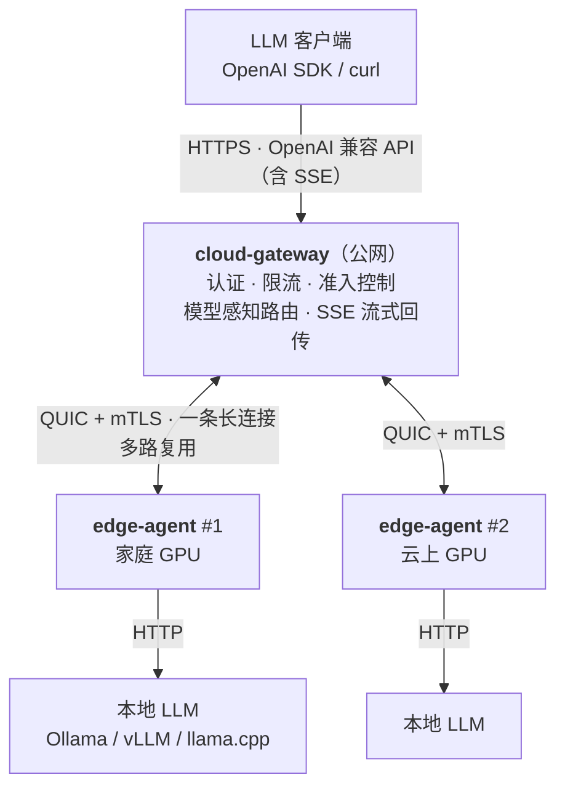

<p align="center"><b>中文</b> | <a href="README.en.md">English</a></p>

# home-llm-gateway

**一个 Rust 实现的边缘 LLM 网关：把内网/家庭网络里的本地模型，安全地暴露成公网上的 OpenAI 兼容 API。**

它解决的是一个具体的网络问题：模型跑在家里或内网的机器上（NAT 后、动态 IP、没有公网入口），而你希望在
任何地方用标准的 OpenAI SDK 调它，同时**不把本地推理端点直接暴露到公网**。

```
客户端（任何地方）
   │  HTTPS · OpenAI 兼容 API（含 SSE 流式）
   ▼
cloud-gateway（公网服务器）   API Key 认证 → 限流 → 准入 → 按 model 路由 → 隧道帧
   │  QUIC（UDP，mTLS 双向认证，一条连接多路复用，无队头阻塞）
   ▼
edge-agent（模型所在机器）    主动拨号 + 心跳 + 断线重连 → 转发给本地 LLM
   │  HTTP
   ▼
本地 LLM（Ollama / vLLM / llama.cpp）
```

**不依赖外部隧道/代理服务**：无需 frp / ngrok / nginx / caddy。隧道、认证、流式转发、TLS 全在这三个
Rust crate 里。

---

## Architecture



### Client → Gateway

公网唯一入口就是 `cloud-gateway`。它暴露 **OpenAI 兼容** 的 `/v1/*` 路径
（`/v1/chat/completions`、`/v1/embeddings` 等按原样透传给 edge；`/v1/models` 由网关自己聚合回答），
支持 **SSE 流式**，并且在转发前完成 API Key 认证与限流。HTTPS 由网关直接用 `rustls` 监听，
**不需要反向代理**——隧道走的是私有帧协议，反代本来也代理不了。

### Gateway → Agent

隧道用 **QUIC** 而不是 TCP+TLS，有三个实际理由：QUIC 的流是**独立**的（一个慢流不阻塞同连接上的其他流，
TCP 上会队头阻塞）；**连接迁移**让 edge agent 在网络地址变化时有机会免于重连（这是 QUIC 传输层的能力，本项目未单独验证）；建连只需 1-RTT。

**由 agent 主动向外拨号**是这套设计的关键——本地机器不需要任何入站端口、不需要公网 IP、不需要 DDNS，
NAT 和动态 IP 因此都不成问题。**mTLS 双向认证**：agent 持云端 CA 签发的客户端证书，未注册的连接
在握手阶段就被拒。

### Agent → LLM

agent 只做一件事：把隧道里收到的请求帧，变成一次对本地 LLM 的 HTTP 请求，再把响应流式回传。
`upstream` 指向本地服务即可（Ollama `:11434`、vLLM / llama.cpp `:8000`），不需要改上游的任何东西。

> 协议细节（帧格式、状态机、取消语义）见 [`DESIGN.md`](DESIGN.md)。

---

## Why

- **本地推理端点不该直接暴露公网。** 三种本地服务（Ollama / vLLM / llama.cpp）默认都**不认证**，
  端口一旦映射出去，等于把 GPU 和 prompt 一起交出去。
- **家庭/内网网络没有稳定的入站入口。** 动态 IP、CGNAT、运营商封端口，
  端口映射在大多数家宽场景下根本不可用。反向连接绕开了这一整类问题。
- **客户端要的是 OpenAI API，不是自建协议。** 用标准 SDK、标准路径、标准 SSE，
  接入成本是"改一个 base_url"。
- **一台机器不够，而且模型不一样。** 家庭机器跑一个模型、云上 GPU 跑另一个，
  客户端只发 `model`，由网关决定去哪台。

---

## Core Features

**API**
- OpenAI 兼容：`/v1/*` 原样透传；`/v1/models` 由网关聚合所有健康 edge 声明的模型
- SSE 流式逐块透传（打字机效果），不在网关缓冲整个响应
- 客户端断开 / 停滞 → 向上游发 `Cancel`，不让边缘继续烧 token
- 请求体上限 16 MiB；请求路径守卫（拒绝点段 / `%2e`·`%2f` 一类编码分隔符）

**Edge Connectivity**
- QUIC 隧道 + mTLS，agent 反向拨号，天然穿透 NAT
- 心跳 + 失联判定；断线指数退避重连（带抖动）
- 每连接流额度可配，避免把"排队"误判成"隧道坏了"

**Routing**
- 按请求 `model` 过滤候选：精确声明优先于 `models: ["*"]` 通配兜底
- 同组内选**在途最少**者；心跳过期者不再参与路由
- 无可用 agent → 503；无人能服务该模型 → 404；容量已满 → 429（三类成因在指标里分开记）

**Security**
- API Key：`sha256(token)` 快速索引定位 + **argon2id** 校验，**明文不落盘**
- 已验证身份缓存（单飞 + 凭据版本核对），把 argon2 从"每请求一次"降到"每凭据版本一次"，
  且**吊销即时生效**、不依赖 TTL
- 调用方凭据（`Authorization` / `Cookie`）只留在「客户端 ↔ 网关」这一跳，**不**随隧道转发给上游
- `admin_token` 与 API Key 相互独立；`/admin/*` 响应带 `Cache-Control: no-store`

**Reliability**
- 建立阶段失败（开流 / 写请求帧）**换一个 agent 重试**：那时请求帧必然未送达，重放无副作用
- 响应头超时（504）**刻意不重试**：请求可能已在模型侧执行，重放会重复计费/重复生成
- 「忙」与「死」分开处置：局部过载不会被误判成连接故障而摘除（见 Core Design）
- 入口侧五处客户端等待全部有上限，停滞的客户端不会永久占住准入槽位

**Observability**
- `/metrics` Prometheus 文本格式；`/healthz` 存活探针（JSON body 带 agent 诊断信息）
- 结构化请求日志，每个请求带 `request_id`、状态码、耗时
- 内置 React 管理面板：总览 / API Keys / Agents / 指标

---

## Quick Start

全部本机跑通，**不需要真实模型**（用 `mock-llm` 当上游）。

**前置**：Rust 1.97+（工具链版本见 `rust-toolchain.toml`）、`openssl` 命令行、`pnpm`（仅 Dashboard 需要）。

```bash
git clone <repo> && cd home-llm-gateway

make setup     # 生成开发证书（certs/out/）+ 安装前端依赖
make dev       # 编译 debug 二进制，一键起 mock-llm + gateway + agent
               # 任一进程没起来就报错退出，并贴出该进程日志末尾
```

`make dev` 起来之后（日志在 `.tmp/logs/`）：

```bash
# 1) 创建第一把 API key —— 网关没有静态 key，全部运行时签发
KEY=$(curl -s -X POST http://127.0.0.1:8080/admin/keys \
  -H "Authorization: Bearer dev-admin" -H "Content-Type: application/json" \
  -d '{"name":"dev"}' | python3 -c "import sys,json;print(json.load(sys.stdin)['key'])")

# 2) 发一次请求 —— 走完 HTTP → 认证 → QUIC 隧道 → agent → 上游 整条链路
curl -H "Authorization: Bearer $KEY" -H "Content-Type: application/json" \
  http://127.0.0.1:8080/v1/chat/completions \
  -d '{"model":"mock-llm","messages":[{"role":"user","content":"你好"}]}'

# 3) 流式
curl -N -H "Authorization: Bearer $KEY" -H "Content-Type: application/json" \
  http://127.0.0.1:8080/v1/chat/completions \
  -d '{"model":"mock-llm","stream":true,"messages":[{"role":"user","content":"你好"}]}'
```

看到 mock 回显即链路打通。`make stop` 停全栈，`make help` 列全部命令。

**接入真实模型**：把 `agent-config.yml` 的 `upstream` 指向本地服务即可，其余不变。

| 本地服务 | `upstream` |
|---|---|
| Ollama | `http://127.0.0.1:11434` |
| vLLM | `http://127.0.0.1:8000` |
| llama.cpp server | `http://127.0.0.1:8000` |

---

## API Example

```bash
curl https://<你的网关>:8443/v1/chat/completions \
  -H "Authorization: Bearer sk-..." \
  -H "Content-Type: application/json" \
  -d '{"model":"qwen2.5","stream":true,
       "messages":[{"role":"user","content":"用一句话解释 QUIC"}]}'
```

任何 OpenAI 兼容客户端同理——改 `base_url` 与 `api_key` 即可：

```python
from openai import OpenAI
client = OpenAI(base_url="https://<你的网关>:8443/v1", api_key="sk-...")
client.chat.completions.create(model="qwen2.5", messages=[{"role": "user", "content": "你好"}])
```

**管理接口**（`admin_token` 启用，也提供网页管理页 `/`）：

```bash
curl -X POST   http://127.0.0.1:8080/admin/keys      -H "Authorization: Bearer <admin-token>" \
  -H "Content-Type: application/json" -d '{"name":"dsh-client"}'   # 返回明文 key，仅此一次
curl           http://127.0.0.1:8080/admin/keys      -H "Authorization: Bearer <admin-token>"   # 列表（脱敏）
curl -X DELETE http://127.0.0.1:8080/admin/keys/<id> -H "Authorization: Bearer <admin-token>"   # 吊销（立即生效）
curl           http://127.0.0.1:8080/admin/agents    -H "Authorization: Bearer <admin-token>"
curl           http://127.0.0.1:8080/admin/usage     -H "Authorization: Bearer <admin-token>"
```

---

## Core Design

README 只讲**结论**；每条的依据、实测与取舍在括号里的文档中。

### 1. 反向拨号 + QUIC 隧道，而不是端口映射

agent 主动向云端建立**一条长连接**，请求在这条连接上以**每请求一条 QUIC 双向流**的方式多路复用。
换来的是：本地零入站端口、天然穿透 NAT、一台机器同时几十条在途请求互不阻塞（TCP 上会队头阻塞）。
代价是自定义了一套 8 种帧的二进制协议（`Register` / `Heartbeat` / `ProxyRequest` /
`ProxyResponseHead` / `ProxyResponseBody` / `ProxyResponseEnd` / `Cancel` / `Error`）。
→ `DESIGN.md` §3–§4

### 2. SSE 流式与取消传播

响应**逐块透传，网关从不缓冲整个响应体**：上游一个 SSE chunk → 一帧 `ProxyResponseBody` →
网关立即回写给客户端，所以长回答是"打字机"而不是"憋到最后一起吐"。

**取消只走 `Cancel` 帧**：客户端断开或停滞时，网关显式发 `Cancel`，agent 用它 abort 正在跑的
上游请求——"用户已经不看了"的请求不会继续烧 GPU/token。响应阶段有三条互不相同的超时
（逐帧空闲 / 客户端停滞 / 取消帧写入），缺一不可。

**每一处转发结尾都有明确的"不完整"信号**：响应体开始回写后 HTTP 状态码已经发出（200），此后失败
（上游断流、空闲超时、客户端停滞、转发任务 panic）在访问日志里不可见，所以每个结尾归入一个显式
出口枚举逐类计数；panic 那一档还会**掐断响应体**，客户端不会把半截回答当完整结果。关停时给在途
SSE 的收尾事件是 `event: error`，**绝不是 `data: [DONE]`**——后者等于谎报"模型答完了"。
→ `DESIGN.md` §4.3、§12

### 3. 只有"帧从未送达"才重试

`write_frame` 是一整块 `write_all`：只有全部字节被接受才返回，超时即帧不完整，agent 侧
`FrameReader` 读完长度前缀+载荷前不会动上游——所以**开流失败 / 写请求帧失败可以安全重放到另一条连接**。

而**响应头超时不能重试**：请求可能已经在模型侧执行，重放会重复计费、重复生成（`temperature > 0`
时结果还不一样）。要把它也做成可安全重试，需要协议级去重（全局唯一 `request_uid` + agent 侧去重表）——
完整设计见 [`EXACTLY_ONCE.md`](EXACTLY_ONCE.md)，**目前是提案、未实现**。
→ `DESIGN.md` §5、`EXACTLY_ONCE.md`

### 4. 「忙」与「死」必须分开：一次实测事故换来的判据

超时不等于连接已死。开流超时可能只是**在途已达承载上限、在排队等 QUIC 流额度**（正常背压）；
响应头超时可能只是**上游首字节慢**（模型在思考）。

把这两种当成"死"会**把局部过载放大成全站不可用**：摘除 → 连接被关 → agent 重连（退避最长 30s）
→ 期间一个可路由 agent 都没有 → 全部 503。云端实测过一次：30 秒压测下 `registry-empty` +6835、
503 +6057。现在的判据是「**在途是否已达承载上限**」（开流）与「**窗口内有没有成功响应头 / 对端还在不在说话**」
（响应头），两类超时各记 `busy`/`dead`、`slow`/`silent` 分开暴露——让"该扩容"与"该查网络"一眼可分。
→ `DESIGN.md` §5

### 5. 模型感知路由：候选筛选与负载均衡

客户端只发 `model`，由网关决定去哪台 edge。筛选四步，每步各有明确的失败语义：

| 步骤 | 规则 | 失败时 |
|---|---|---|
| 健康 | 只保留心跳未过期的 edge | 全过期 / 无人 → 503 |
| 模型 | 只保留声明了该 `model`（或 `*`）的 edge | 无人能服务 → 404 |
| 排序 | **精确声明优先**于 `*` 通配；同级内**在途最少者优先** | — |
| 准入 | 原子占位成功才算选中；占满换下一个 | 全满 → 429 |

`*` 通配是**兜底、不抢单**——所以 `/v1/models` 聚合时不把 `*` 列进去（列了会误导客户端：它接受
任意请求，但具体能跑什么只有上游知道）。
→ `MODEL_ROUTING.md`、`DESIGN.md` §5

### 6. 分离「速率」「每 agent 并发」「全局在途」三道闸

三者职责不同、不能互相替代，混用会得到错误的容量结论：

| 配置 | 管什么 | 保谁 |
|---|---|---|
| `rate_limit_per_min` | 每个 API Key 的**请求速率**（令牌桶） | 公平性 / 成本 |
| agent 的 `max_concurrency` | **每个 edge** 的在途请求数 | edge 的 GPU |
| `max_concurrent_requests` | **整个网关**的在途请求总数 | 网关自己 |
| `max_entry_connections` | 公网入口的并发**连接**数（满额暂停 accept，不拒绝） | fd |

`/healthz` 与 `/metrics` 各有**独立**的宽松额度，不吃受限预算——否则探针被 429 会让 LB 摘掉一个
**健康**实例，把"慢"放大成"全挂"。
→ `REBUILD.md` §4.1、`DESIGN.md` §5

### 7. argon2 是内存硬的，所以不能每请求校验一次

`argon2id` 每次校验独占 **19 MiB** 工作内存（`m=19456 KiB`），且随并发线性叠加——
"每请求校验一次"意味着网关内存 = `在途请求数 × 19MiB`。受控对照实测：64 并发下
**1 236.5 MB vs 27.1 MB**（缓存关闭 vs 开启）。

现在走**已验证身份缓存 + 单飞**：`sha256(token)` O(1) 定位，命中即跳过 argon2（只做
`enabled` 与 `cred_version` 两次比较）；同一 token 的并发冷启动被串行化，只跑一次。
**吊销仍然即时生效**——靠凭据版本核对，不靠 TTL。
→ `DESIGN.md` §5「已验证身份缓存」、`OPTIMIZATION.md` §8

---

## Testing

```bash
make test                              # cargo test（串行由 #[serial] 保证）
cargo nextest run --workspace          # CI 用的就是这个
make check                             # 全量门槛：见下
```

覆盖范围：协议帧编解码 roundtrip、流式与取消、认证与限流、模型路由、准入与并发、
优雅关闭、真实进程的启动/信号/日志，以及端到端全链路（内存生成证书起完整
QUIC + mTLS 栈，不需要任何外部服务）。

`make check` 是本地等价于 CI 的一键全量验证：

```
fmt · clippy -D warnings · cargo deny · nextest · web-format · web-lint · web-test ·
web-build · toolchain-check · check-records
```

> **当前规模（`cargo nextest run --workspace` 实测）**：**368 个被执行且通过的测试（0 skipped）**，其中
> **69 条 e2e**（每个 e2e 在独立进程里起完整 QUIC + mTLS 栈）。这个数字随提交变化，以实跑输出为准。
>
> 两点与 `cargo test` 不同的行为要知道：**nextest 每条测试一个进程**，所以 `serial_test` 的
> `#[serial]`（进程内锁）在它下面失效——e2e 的串行改由 `.config/nextest.toml` 的 `test-group`
> 保证；另外 **nextest 不跑 doctest**。

---

## Performance

仓库包含两类性能证据，**完整数据与测量前提不放在这里**：

- **Criterion 微基准**（函数级）：`cargo bench`（协议帧编解码、keystore 安全热路径）
- **系统级压测**：k6 脚本在 `scripts/bench-k6/`（SSE 长流 + 非流式吞吐两个场景，内置成功率与
  延迟分位断言）；快速验证可用 `oha`

```bash
cargo bench                   # 或 make bench
make dev && make bench-k6 KEY=<sk-...> VUS=20 DUR=30s
```

**README 只保留两条结论，因为它们会改变你的部署决策**：

1. **网关内存跟「在途」走，不跟「请求数」走**——前提是默认开启的身份校验缓存（`verified_cache_max`）。
   把它设成 `0` 会让每个在途请求吃约 19 MiB，此时 `max_concurrent_requests` 必须收在
   `MemoryMax / 20MB` 之下，否则先撞的是 OOM 而不是优雅的 429。
2. **压测时先分清瓶颈在谁身上**：判断顺序是 **agent 的事件速率 → 链路带宽 → 网关**。
   真实模型 20–100 token/s 下这些都远未到顶；只有在"把模型换快"或"拿网关转发非 LLM 小请求"时，
   下面的数字才有意义。

→ **完整实测数据（内存对照表、agent 每事件 CPU、吞吐上限、云出口带宽、请求体阶梯、本机回环、
768 并发档）见 [`OPTIMIZATION.md`](OPTIMIZATION.md) §8**

---

## Deployment

生产部署（证书签发、安全组、systemd / Docker、验证、排障）见 **[`DEPLOY.md`](DEPLOY.md)**。
要点：

1. **网关放公网服务器**：安全组放行 **UDP 4433**（QUIC 隧道）与 **TCP 8443**（HTTPS API）。
   UDP 容易漏——QUIC 走 UDP；**当前版本只有 UDP 传输、未实现 TCP 降级**。若 UDP 被封，目前需要放行 UDP 4433；TCP+TLS 降级只是备选设计，见 [`DESIGN.md`](DESIGN.md) §10。
2. **agent 放模型所在机器**：`cloud_addr` 填 `<公网IP>:4433`，`server_name` 填证书 SAN 中的域名。
3. **mTLS 是关键安全线**：CA 私钥自己保管，**每个 agent 单独签发**客户端证书。
4. 部署形态：单静态二进制（Linux musl / macOS）+ systemd 单元，或 Docker Compose
   （`crates/gateway/Dockerfile` 已把 Dashboard 编进镜像，无需自建前端）。
5. **多台 edge（异构模型）**：各写一份 `agent-config.yml` 声明自己的 `models` 即可，
   配置示例与 `agent_id` 必须唯一的那个陷阱见 [`MODEL_ROUTING.md`](MODEL_ROUTING.md) §7。

> 网关启动时会自己把 `RLIMIT_NOFILE` 的 soft 抬到 `min(hard, 16384)`——systemd 默认的 1024
> 在生产水位（768 并发连接 → fd 峰值 785）上是贴脸的。理由与 unit 的分工见 `DESIGN.md` §14。

---

## Repository Structure

```
crates/
├── proto/      隧道帧协议 + 共享原语（帧编解码、mTLS 材料加载、逐跳头/凭据头过滤、路径守卫）
├── gateway/    cloud-gateway 二进制（Axum + Tokio + s2n-quic server + SQLite keystore）
├── agent/      edge-agent 二进制（Tokio + s2n-quic client + reqwest）
└── mock-llm/   OpenAI 兼容的假 LLM（无真实模型时打通链路用）
web/            React + TS 管理面板（Vite + React 19 + Tailwind；网关启动即托管）
certs/          开发证书生成脚本
deploy/         systemd 单元（gateway.service / agent.service）
scripts/        release 打包 · k6 压测 · 工具链一致性检查 · git pre-commit hook
gateway-config.example.yml / agent-config.example.yml   两份配置模板（含全部参数注释）
deny.toml       cargo-deny 策略（依赖许可证 / 公告）
```

> 配置文件命名固定：网关 `gateway-config.yml`、agent `agent-config.yml`（本地与生产一致，
> 均含密钥类信息，已 gitignore）。

---

## Documentation

| 文档 | 内容 |
|---|---|
| [`DESIGN.md`](DESIGN.md) | **架构与协议**：QUIC 选型、帧协议、超时矩阵、重试与摘除语义、安全清单、可观测性规格、NOFILE |
| [`MODEL_ROUTING.md`](MODEL_ROUTING.md) | **模型路由**：按 model 过滤候选、精确优先、`/v1/models` 聚合语义 |
| [`OPTIMIZATION.md`](OPTIMIZATION.md) | **优化方案 + 实测记录**：改了什么的清单，以及内存 / CPU / 吞吐的完整数据与测量前提 |
| [`DEPLOY.md`](DEPLOY.md) | **部署**：证书签发、安全组、systemd / Docker、升级、排障 |
| [`REBUILD.md`](REBUILD.md) | **重建蓝图**：不可逆决策清单、流量与并发规格、12 条验收断言 |
| [`EXACTLY_ONCE.md`](EXACTLY_ONCE.md) | **提案（未实现）**：协议级去重，让响应头超时也能安全重试 |
| [`CERT_MANAGEMENT.md`](CERT_MANAGEMENT.md) | **设计（未实现）**：证书与信任根的动态管理——加 agent 不重启网关、CSR 路线（私钥不出机器）、信任语义与身份难点 |
| [`CODE_READING.md`](CODE_READING.md) | **源码阅读指南**：从哪开始读、锚点文件、验证式学习法 |
| [`TODO.md`](TODO.md) | **开发状态与 roadmap**（同时是已知问题登记表） |

---

## Roadmap

见 **[`TODO.md`](TODO.md)**——当前开发状态、已知问题与优先级都在那里。

其中两项与使用者直接相关，需要明确其状态：

- **`EXACTLY_ONCE.md` 是提案，未实现。** 目前响应头超时（504）**不会**自动重试。
- **多 CA 信任根、用量计量的更细粒度**等项同样在 `TODO.md` 中登记，尚未实现。

---

## License

MIT，见 [`LICENSE`](LICENSE)。
